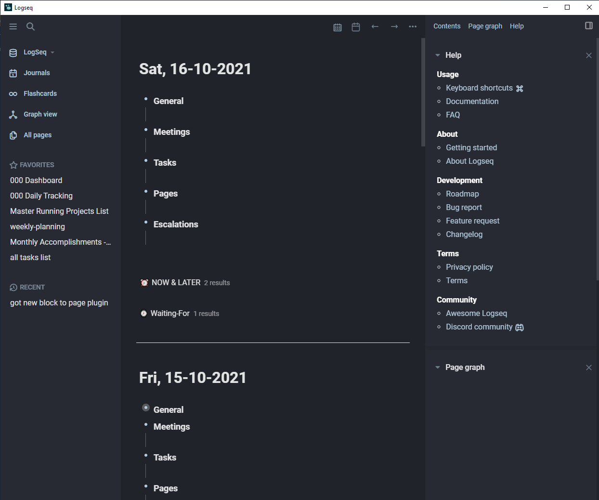

# Logseq Plain Clean Theme

This Logseq theme is based on these themes and much borrowing from logseq discord
https://github.com/DubininDmitry/Harmony-theme-for-Logseq/edit/main/custom.css
https://github.com/PiotrSss/logseq-clean-themes/blob/main/custom.css

## Key Features

- Easy on the eyes but kept simple
- Dark left sidebar and light right sidebar
- Headings shortened to a more reasonable size
- Tags blend in

To put this theme into your Logseq, copy and paste the contents of custom.css file into your logseq/custom.css file.

# Screenshots

